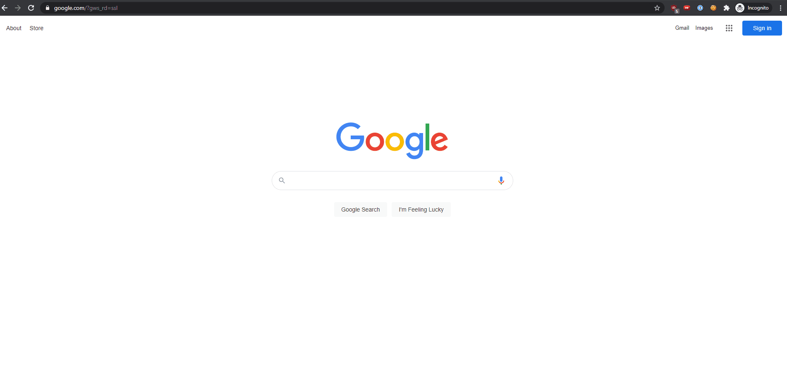

# search_engines

Search Engines are aliases for the Chrome omnibar



## Examples

Here's a list of my generic favorites :

| Keyword | Query URL |
| --- | --- |
| `c` | `http://webcache.googleusercontent.com/search?q=cache:%s` |
| `cookie` | `chrome://settings/siteData?search=cookies` |
| `dt` | `https://%s.live.dynatrace.com/` |
| `gc` | https://calendar.google.com/calendar/r |
| `gd` | `https://drive.google.com/drive/u/0/my-drive` |
| `gv` | `https://voice.google.com/u/0/messages` |
| `sp` | https://github.com/SpencerWoo?tab=repositories |
| `re` | http://old.reddit.com/r/%s | 

I've attached a sample `search_engines.json` with these shortcuts.

## Usage

1. `chrome://settings/searchEngines`

2. Open console via Chrome Developer Tools

3. [import](#import) the [sample](search_engines.json) `search_engines.json`

4. Add more SE entries for your daily work usage (JIRA, GitHub, internal platforms/environments, etc).

## Import
```
(async function importSEs() {
  /* Auxiliary function to open a file selection dialog */
  function selectFileToRead() {
    return new Promise((resolve) => {
      const input = document.createElement('input');
      input.setAttribute('type', 'file');
      input.addEventListener('change', (e) => {
        resolve(e.target.files[0]);
      }, false);
      input.click();
    });
  }

  /* Auxiliary function to read data from a file */
  function readFile(file) {
    return new Promise((resolve) => {
      const reader = new FileReader();
      reader.addEventListener('load', (e) => {
        resolve(e.target.result);
      });
      reader.readAsText(file);
    });
  }

  const file = await selectFileToRead();
  const content = await readFile(file);
  const searchEngines = JSON.parse(content);
  searchEngines.forEach(({ name, keyword, url }) => {
    /* Actual search engine import magic */
    chrome.send('searchEngineEditStarted', [-1]);
    chrome.send('searchEngineEditCompleted', [name, keyword, url]);
  });
}());
```

## Export
```
(function exportSEs() {
  /* Auxiliary function to download a file with the exported data */
  function downloadData(filename, data) {
    const file = new File([data], { type: 'text/json' });
    const elem = document.createElement('a');
    elem.href = URL.createObjectURL(file);
    elem.download = filename;
    elem.click();
  }

  let searchEngines = [];
  document.querySelector('settings-ui').shadowRoot
    .querySelector('settings-main').shadowRoot
    .querySelector('settings-basic-page').shadowRoot
    .querySelector('settings-search-page').shadowRoot
    .querySelector('settings-search-engines-page').shadowRoot
    .querySelector('settings-search-engines-list#otherEngines').shadowRoot
    .querySelectorAll('settings-search-engine-entry')
    .forEach($el => searchEngines.push(
      {
        name: $el.shadowRoot.querySelector('#name-column').textContent,
        keyword: $el.shadowRoot.querySelector('#keyword-column').textContent,
        url: $el.shadowRoot.querySelector('#url-column').textContent
      })
    )

  downloadData('search_engines.json', JSON.stringify(searchEngines));
}());
```